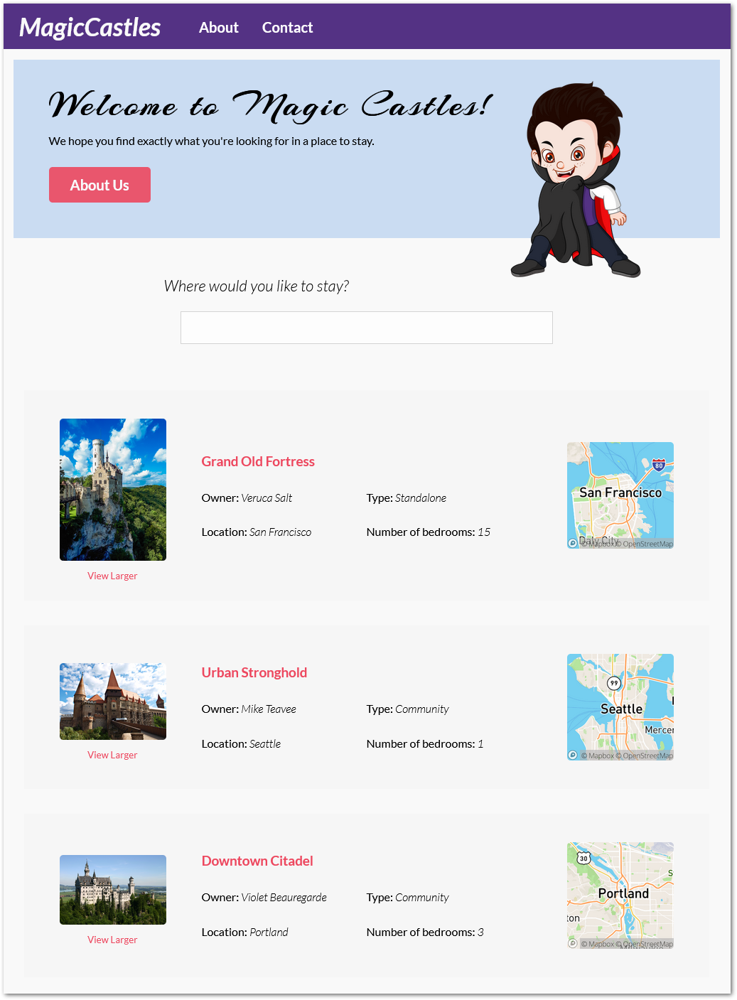
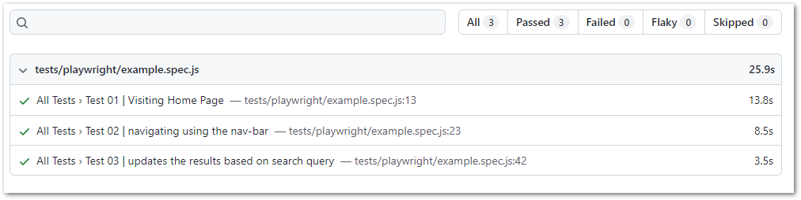
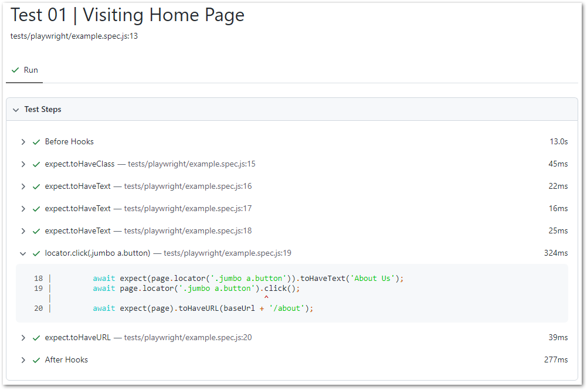

# super-rentals

Ember.js [Super Rentals official tutorial](https://guides.emberjs.com/release/tutorial/) updated with Playwright Test Framework and lovingly renamed into Magic Castles


# is now Magic Castles

* Added: Playwright Test Framework
* SuperRentals renamed into MagicCastles
* Mascot hamster(?) Tomster is now Eddie (cute vegetarian vampire) #teamedward



## Prerequisites

You will need the following things properly installed on your computer.

* [Git](https://git-scm.com/)
* [Node.js](https://nodejs.org/) (with npm)
* [Ember CLI](https://cli.emberjs.com/release/)
* [Google Chrome](https://google.com/chrome/)


## Installation

* `git clone <repository-url>` this repository
* `cd super-rentals`
* `npm install`

## Running / Development

* `ember serve`
* Visit your app at [http://localhost:4200](http://localhost:4200).
* Visit your tests at [http://localhost:4200/tests](http://localhost:4200/tests).


### Code Generators

Make use of the many generators for code, try `ember help generate` for more details

### Running Tests

* `ember test`
* `ember test --server`

## Running Playwright Tests

Run the following command in CLI Terminal, if prompted to install Playwright libraries accept the suggested installation.

**--headed** parameter is added to see tests executed, to run in headless mode (Playwright default) remove this from the command below.

```
npx playwright test "example.spec.js" --headed --reporter=html
```



### Linting

* `npm run lint`
* `npm run lint:fix`

### Building

* `ember build` (development)
* `ember build --environment production` (production)

### Deploying

Specify what it takes to deploy your app.

## Further Reading / Useful Links

* [ember.js](https://emberjs.com/)
* [ember-cli](https://cli.emberjs.com/release/)
* Development Browser Extensions
  * [ember inspector for chrome](https://chrome.google.com/webstore/detail/ember-inspector/bmdblncegkenkacieihfhpjfppoconhi)
  * [ember inspector for firefox](https://addons.mozilla.org/en-US/firefox/addon/ember-inspector/)

## Useful commands

### To start the app server
```
ember server
```
### To statrt QUnit Ember test server

```
ember test server
```
or
```
ember t -s
```

### To run tests using ember-play (Playwright test runner for ember)
- install following instructions here: https://emberobserver.com/addons/ember-play
```
ember play -f
```

### to run Playwright test, runs headless by default
```
npx playwright test
```
or headed
```
npx playwright test --headed
```
or headed with nicely formatted html report
```
npx playwright test --headed --reporter=html
```
